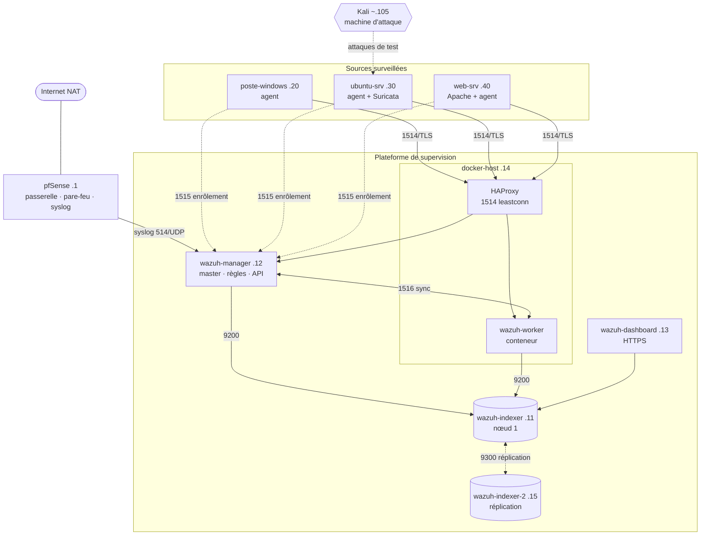

<div align="center">

# 🛡️ OSIRIS

### Plateforme de supervision de sécurité SIEM / XDR open-source

*Du besoin client à la plateforme d'entreprise : conception, déploiement progressif et validation d'une architecture Wazuh en trois phases.*


**Projet Mastercamp · EFREI Paris · Cycle ingénieur Cybersécurité · Groupe SR-2E · Promo 2028**

</div>

---

## 📑 Sommaire

- [Présentation](#-présentation)
- [Fonctionnalités](#-fonctionnalités)
- [Architecture](#-architecture)
- [Trajectoire en trois phases](#-trajectoire-en-trois-phases)
- [Stack technique](#-stack-technique)
- [Environnement de laboratoire](#-environnement-de-laboratoire)
- [Démarrage rapide](#-démarrage-rapide)
- [Configurations clés](#-configurations-clés)
- [Démonstration : de la détection à la réponse](#-démonstration--de-la-détection-à-la-réponse)
- [Recette](#-recette)
- [Pièges rencontrés et solutions](#-pièges-rencontrés-et-solutions)
- [Limites et feuille de route](#-limites-et-feuille-de-route)
- [Équipe](#-équipe)
- [Avertissement](#%EF%B8%8F-avertissement)

---

## 🎯 Présentation

Beaucoup de PME collectent des journaux (serveurs, postes, pare-feu) sans jamais les exploiter. Résultat : aucune visibilité sur les attaques et aucune preuve de conformité.

**OSIRIS** répond à ce problème avec une plateforme **SIEM + XDR 100 % open-source**, sans coût de licence, qui :

- **collecte** les événements de sources hétérogènes (Windows, Linux, serveur web, pare-feu) ;
- **corrèle** des événements isolés pour produire des alertes qualifiées ;
- **enrichit** les alertes (CVE, threat intelligence, MITRE ATT&CK, tags RGPD / ISO 27001) ;
- **répond** automatiquement aux attaques (blocage d'IP par Active Response).

> **En une phrase :** le SIEM passe d'un outil qui *observe* à une plateforme qui *détecte, corrèle et répond*.

Le tout tient sur **un seul hôte de 16 Go de RAM**, grâce à une discipline stricte de groupes d'allumage et de snapshots.

---

## ✨ Fonctionnalités

| Domaine | Capacité | Détail |
|---|---|---|
| 📥 **Collecte** | Centralisée, multi-OS | Agents Windows / Linux (TLS) + pfSense en agentless (syslog 514/UDP) |
| 🔍 **Détection** | Règles natives + personnalisées | Force brute SSH, processus suspect depuis `/tmp`, scan web |
| 🔗 **Corrélation** | Règle custom `100001` | 6 échecs SSH / même IP / 120 s → alerte niveau 12 (MITRE T1110) |
| 📁 **FIM** | Intégrité des fichiers en temps réel | Création, modification, suppression dans `/etc` et dossiers sensibles |
| 🩹 **Vulnérabilités** | Détection de CVE | Inventaire Syscollector comparé à la base CVE Wazuh |
| 🔔 **Alerting** | E-mail + webhook | Relais Postfix → Gmail et salon Discord pour les alertes ≥ niveau 10 |
| 🗄️ **Rétention** | Cycle de vie des index (ISM) | Suppression automatique après 90 jours |
| 🌐 **IDS réseau** | Suricata 8.0.5 | 51 000+ règles ET/Open, alertes EVE JSON remontées dans Wazuh |
| 🕵️ **Threat intel** | Listes CDB + VirusTotal | ~636 IoC (Feodo Tracker, ET compromised IPs) + analyse des hachages FIM |
| ⚡ **Réponse** | Active Response | `firewall-drop` bannit l'IP attaquante pendant 10 minutes |
| ♻️ **Haute dispo** | Cluster indexer + managers | Réplication OpenSearch, worker Docker, équilibrage HAProxy |
| 📜 **Conformité** | RGPD + ISO/IEC 27001:2022 | Tags automatiques, SCA / CIS, rapports PDF |

---

## 🏗️ Architecture

Réseau isolé **VMnet3 · 192.168.50.0/24**, pfSense en passerelle.



**Pipeline d'analyse :** agent → HAProxy → manager (pré-décodage → décodage → règles, gravité 0 à 15) → indexer → dashboard.

---

## 🚀 Trajectoire en trois phases

Chaque phase enrichit la précédente **sans changer d'outil**, et se termine par une recette validée.

| Phase | Architecture | Apports | Conformité | Statut |
|---|---|---|---|---|
| **1 · Minimale** | Tout-en-un | 4 sources, collecte, détection, FIM, dashboard | RGPD | ✅ Validée |
| **2 · Intermédiaire** | Distribuée (3 nœuds) | Corrélation custom, CVE, alerting, rétention ISM | RGPD + ISO 27001 | ✅ Validée |
| **3 · Avancée** | Cluster + conteneurs | HA indexer, worker Docker, HAProxy, Suricata, threat intel, Active Response | RGPD + ISO 27001 | ✅ Validée |

---

## 🧰 Stack technique

| Composant | Version | Rôle |
|---|---|---|
| Wazuh (indexer, manager, dashboard, agent) | 4.14.5 | Cœur SIEM / XDR |
| OpenSearch + Filebeat | fournis par Wazuh | Stockage, recherche, acheminement des alertes |
| pfSense CE | 2.8.0 | Pare-feu, passerelle, source syslog |
| Ubuntu Server | 24.04 LTS | Serveurs de supervision et endpoints Linux |
| Windows | 10 Pro | Endpoint surveillé |
| Docker + Compose | | Worker Wazuh conteneurisé |
| HAProxy | 2.9-alpine | Équilibrage de charge des managers |
| Suricata | 8.0.5 (PPA OISF) | IDS réseau |
| Kali Linux | | Tests d'attaque (nmap, hydra, gobuster) |
| VMware Workstation Pro | | Hyperviseur, réseaux virtuels |

**Pourquoi Wazuh ?** Comparé à Security Onion, Elastic Security, Graylog et OSSIM, c'est la seule solution open-source qui réunit nativement SIEM + XDR + FIM + agentless + MITRE ATT&CK + module RGPD, et dont l'architecture suit exactement la progression tout-en-un → distribué → cluster.

---

## 🖥️ Environnement de laboratoire

### Plan d'adressage

| Machine | IP | Rôle | RAM |
|---|---|---|---|
| pfSense | `.1` | Passerelle, pare-feu, syslog | 1 Go |
| wazuh-indexer | `.11` | Indexer nœud 1 | 4 Go |
| wazuh-manager | `.12` | Manager master + API | 3 Go |
| wazuh-dashboard | `.13` | Interface web HTTPS | 2 Go |
| docker-host | `.14` | Worker Wazuh + HAProxy | 2 Go |
| wazuh-indexer-2 | `.15` | Indexer nœud 2 (réplication) | 2,5 Go |
| poste-windows | `.20` | Endpoint Windows | 4 Go |
| ubuntu-srv | `.30` | Endpoint Linux + Suricata | 2 Go |
| web-srv | `.40` | Serveur web Apache | 2 Go |
| Kali | `~.105` | Machine d'attaque | 4 Go |

### Flux réseau

| Flux | Port | Usage |
|---|---|---|
| Agent → HAProxy → managers | `1514/TCP` (TLS) | Remontée des événements |
| Agent → master | `1515/TCP` (TLS) | Enrôlement |
| Manager → indexer | `9200/TCP` | Alertes (Filebeat) |
| Indexer ↔ indexer | `9300/TCP` | Transport du cluster |
| Master ↔ worker | `1516/TCP` | Synchronisation des managers |
| pfSense → manager | `514/UDP` | Syslog agentless |
| Analyste → dashboard | `443/TCP` | Interface web |

### Groupes d'allumage (la discipline des 16 Go)

> ⚠️ Ne **jamais** démarrer toutes les VM en même temps.

| Groupe | Machines | RAM | Démontre |
|---|---|---|---|
| **Socle** | pfSense + indexer + manager + dashboard | ~9-10 Go | Plateforme de base |
| **Cluster / LB** | Socle + docker-host + indexer-2 | ~14-15 Go | HA, worker, HAProxy, réplication |
| **Détection** | Socle + ubuntu-srv + Kali | ~13 Go | Suricata, Active Response, threat intel |

---

## ⚡ Démarrage rapide

### Phase 1 · Tout-en-un

```bash
curl -sO https://packages.wazuh.com/4.14/wazuh-install.sh
sudo bash ./wazuh-install.sh -a

# Récupérer le mot de passe admin généré
sudo tar -O -xvf wazuh-install-files.tar wazuh-install-files/wazuh-passwords.txt
```

Dashboard : `https://192.168.50.10` (certificat auto-signé).

### Enrôler un agent Linux

```bash
sudo WAZUH_MANAGER="192.168.50.10" WAZUH_AGENT_NAME="ubuntu-srv" apt install -y wazuh-agent
sudo systemctl enable --now wazuh-agent
```

### Phase 2 · Déploiement distribué

```bash
# Sur l'indexer (.11) : générer certificats et mots de passe à partir de config.yml
sudo bash ./wazuh-install.sh --generate-config-files

sudo bash ./wazuh-install.sh --wazuh-indexer node-1
sudo bash ./wazuh-install.sh --start-cluster
sudo bash ./wazuh-install.sh --wazuh-server wazuh-1        # sur .12
sudo bash ./wazuh-install.sh --wazuh-dashboard dashboard   # sur .13
```

### Phase 3 · Worker conteneurisé

```bash
# Sur docker-host (.14)
cd ~/wazuh-worker && docker compose up -d

# Sur le master (.12)
sudo /var/ossec/bin/cluster_control -l
# → manager-master (master, .12) + manager-worker (worker, .14)
```

---

## 🔧 Configurations clés

<details>
<summary><b>Règle de corrélation : force brute SSH soutenue (100001)</b></summary>

```xml
<group name="local,syslog,sshd,">
  <rule id="100001" level="12" frequency="6" timeframe="120">
    <if_matched_sid>5710</if_matched_sid>
    <same_source_ip />
    <description>Force brute SSH soutenue depuis $(srcip)</description>
    <mitre><id>T1110</id></mitre>
  </rule>
</group>
```
</details>

<details>
<summary><b>Active Response : bannissement automatique de l'attaquant</b></summary>

```xml
<active-response>
  <command>firewall-drop-lab</command>
  <location>local</location>
  <rules_id>100001,5763</rules_id>
  <timeout>600</timeout>
</active-response>
```

> À répliquer sur le master **et** le worker : les blocs `active-response` ne sont pas synchronisés par le cluster.
</details>

<details>
<summary><b>Intégration Suricata (sur ubuntu-srv)</b></summary>

```xml
<localfile>
  <log_format>json</log_format>
  <location>/var/log/suricata/eve.json</location>
</localfile>
```

Et sur le manager, dans `local_internal_options.conf` :

```ini
analysisd.decoder_order_size=1024
```
</details>

<details>
<summary><b>Validation avant tout redémarrage du manager</b></summary>

```bash
sudo /var/ossec/bin/wazuh-analysisd -t
sudo /var/ossec/bin/wazuh-logtest     # rejouer une ligne de log et voir la règle déclenchée
```
</details>

---

## 🎬 Démonstration : de la détection à la réponse

**Scénario A · Force brute SSH**

```bash
# Depuis Kali
hydra -l fakeuser -P /usr/share/wordlists/rockyou.txt ssh://192.168.50.30 -t 4
```

1. Chaque échec lève la règle native `5710` (niveau 5).
2. Au 6e échec en moins de 120 s, la règle `100001` se déclenche (niveau 12, MITRE T1110, tags ISO 27001).
3. Notification Discord + e-mail en temps réel.
4. `firewall-drop` bannit `192.168.50.105` :

```bash
sudo iptables -L -n | grep 192.168.50.105
DROP  0  --  192.168.50.105  0.0.0.0/0
```

5. La tentative suivante de Hydra échoue en `Timeout connecting to 192.168.50.30`. ✅

**Scénario B · Threat intelligence**

Dépôt d'un fichier de test **EICAR** dans un dossier surveillé → le FIM détecte la création → le hachage (jamais le fichier) part vers VirusTotal → alerte `87105` niveau 12 enrichie du verdict, MITRE T1203 et lien VirusTotal. ✅

---

## ✅ Recette

**23 tests, 23 validés**, répartis sur 5 exigences.

| Exigence | Tests | Exemples | Résultat |
|---|---|---|---|
| 1 · Collecte et supervision | 1 à 4 | Dashboard, 3 agents actifs, syslog pfSense | ✅ |
| 2 · Détection et corrélation | 5 à 8 | Règles 5712, 100001, 100020, scan web 31151 | ✅ |
| 3 · Intégrité des fichiers | 9 à 10 | Règles FIM 553 et 550 | ✅ |
| 4 · CVE, alerting, rétention, ISO 27001 | 11 à 15 | CVE détectées, e-mail, Discord, ISM 90 j, SCA | ✅ |
| 5 · Cluster, conteneurs, IDS, threat intel, réponse | 16 à 23 | Cluster GREEN (64 shards), bascule yellow, HAProxy, Suricata, IoC 99915, VirusTotal 87105, Active Response | ✅ |

---

## 🪤 Pièges rencontrés et solutions

| Problème | Solution |
|---|---|
| Saturation mémoire de l'hôte | Groupes d'allumage stricts, fichier d'échange, snapshots avant toute opération sensible |
| `client.keys` repasse en `root` après un enrôlement avec sudo | `sudo chown wazuh:wazuh /var/ossec/etc/client.keys` + override systemd (`ExecStartPost`) |
| `config.yml` de l'installeur ignoré | Le fichier **à l'intérieur** de `wazuh-install-files.tar` fait autorité : le mettre à jour avant d'installer un nouveau nœud |
| Suricata 8.x : *Too many fields for JSON decoder* | `analysisd.decoder_order_size=1024` |
| Agents invisibles après passage en distribué | Nouvelle autorité de certification : ré-enrôler chaque agent |
| Active Response absente sur le worker | Répliquer les blocs `command` / `active-response` sur master et worker |
| Agent qui bascule master ↔ worker via HAProxy | Fixer temporairement le nœud pour une démo déterministe |
| Moteur mail Wazuh sans auth SMTP moderne | Relais Postfix local en smarthost vers Gmail (587) |
| Copier-coller cassé dans la console VMware | Travailler en SSH ou en commandes sur une ligne |

---

## 🗺️ Limites et feuille de route

**Non réalisé (phase 3), faute de RAM et de temps :**

- [ ] Gestion des identités : Active Directory (Samba AD)
- [ ] Intégration cloud : AWS CloudTrail (module `aws-s3` natif)
- [ ] Analyse comportementale étendue (command monitoring, rootcheck)
- [ ] Conformité PCI DSS

**Pistes d'industrialisation :**

- [ ] 3e nœud indexer (ou nœud *voting-only*) pour éviter le split-brain
- [ ] Orchestration Kubernetes / K3s multi-hôtes à la place de Docker Compose
- [ ] Plusieurs workers et master redondé
- [ ] Hôte 32 Go+ pour faire tourner toutes les VM simultanément
- [ ] Alimentation automatique élargie des listes d'IoC et réglage fin des faux positifs

---

## 👥 Équipe

**Groupe SR-2E · EFREI Paris**

| Membre | Rôle |
|---|---|
| **Yves de Kerros** | Chef de projet / MOE |
| **Robinson Diallo** | Responsable MOA |
| **Nathan Favry** | Responsable technique |
| **Anaïs Djenadi** | Gouvernance & Communication |
| **Noor Fadlane** | Risques, Budget, Qualité & Documentation |

**Commanditaire :** RSSI d'une PME cliente (fictive) · **Sponsor :** Direction générale · **Soutenance :** 9 juillet 2026

---

## ⚠️ Avertissement

Ce projet est réalisé **dans un cadre pédagogique**, sur un réseau de laboratoire **isolé**. Les outils d'attaque (Hydra, nmap, gobuster) et le fichier EICAR ne doivent être utilisés que sur des systèmes dont vous avez la propriété ou une autorisation explicite.

Tous les composants utilisés sont open-source et employés conformément à leurs licences (Wazuh GPLv2 / Apache 2.0, Suricata GPLv2, HAProxy GPLv2, pfSense Apache 2.0).

<div align="center">

---

*Made with ☕ and 16 Go de RAM bien optimisés.*

</div>
